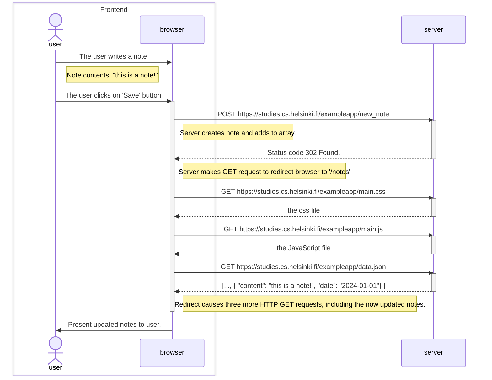

```mermaid
sequenceDiagram
  box Frontend
  actor user
  participant browser
  end
  participant server

  user->>browser: The user writes a note

  Note right of user: Note contents: "this is a note!"

  user->>browser: The user clicks on 'Save' button
  activate browser
  browser->>server: POST https://studies.cs.helsinki.fi/exampleapp/new_note
  activate server

  Note right of browser: Server creates note and adds to array.

  server-->>browser: Status code 302 Found.
  deactivate server

  Note right of browser: Server makes GET request to redirect browser to '/notes'


  browser->>server: GET https://studies.cs.helsinki.fi/exampleapp/main.css
  activate server
  server-->>browser: the css file
  deactivate server

  browser->>server: GET https://studies.cs.helsinki.fi/exampleapp/main.js
  activate server
  server-->>browser: the JavaScript file
  deactivate server

  browser->>server: GET https://studies.cs.helsinki.fi/exampleapp/data.json
  activate server
  server-->>browser: [..., { "content": "this is a note!", "date": "2024-01-01"} ]
  deactivate server
  
  Note right of browser: Redirect causes three more HTTP GET requests, including the now updated notes.

  deactivate browser
  browser->>user: Present updated notes to user.
```
