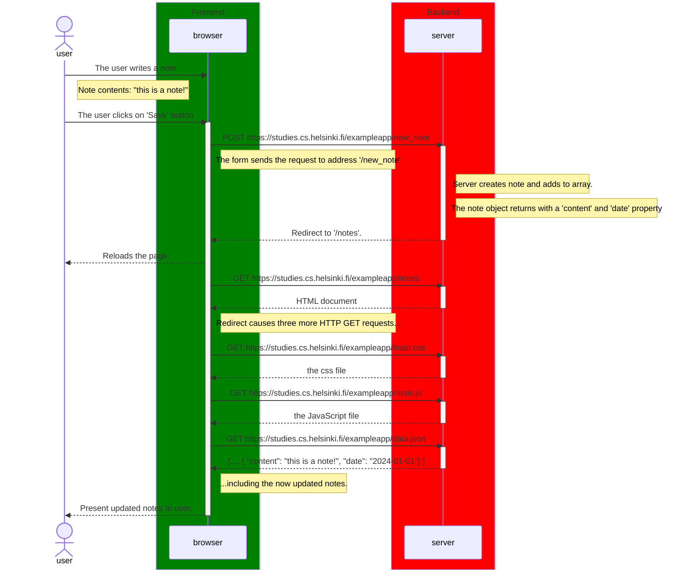

```mermaid
sequenceDiagram
  actor user 
  box Green Frontend
  participant browser
  end
  box Red Backend
  participant server
  end

  user->>browser: The user writes a note

  Note right of user: Note contents: "this is a note!"

  user->>browser: The user clicks on 'Save' button
  activate browser
  browser->>server: POST https://studies.cs.helsinki.fi/exampleapp/new_note
  activate server

  Note right of browser: The form sends the request to address '/new_note'

  Note right of server: Server creates note and adds to array.

  Note right of server: The note object returns with a 'content' and 'date' property

  server-->>browser: Redirect to '/notes'.
  deactivate server
  browser-->>user: Reloads the page.
 
  browser->>server: GET https://studies.cs.helsinki.fi/exampleapp/notes
  activate server
  server-->>browser: HTML document
  deactivate server

  Note right of browser: Redirect causes three more HTTP GET requests...

  browser->>server: GET https://studies.cs.helsinki.fi/exampleapp/main.css
  activate server
  server-->>browser: the css file
  deactivate server

  browser->>server: GET https://studies.cs.helsinki.fi/exampleapp/main.js
  activate server
  server-->>browser: the JavaScript file
  deactivate server

  browser->>server: GET https://studies.cs.helsinki.fi/exampleapp/data.json
  activate server
  server-->>browser: [..., { "content": "this is a note!", "date": "2024-01-01"} ]
  deactivate server

  Note right of browser: ...including the now updated notes.

  browser-->>user: Present updated notes to user.
  deactivate browser
```
