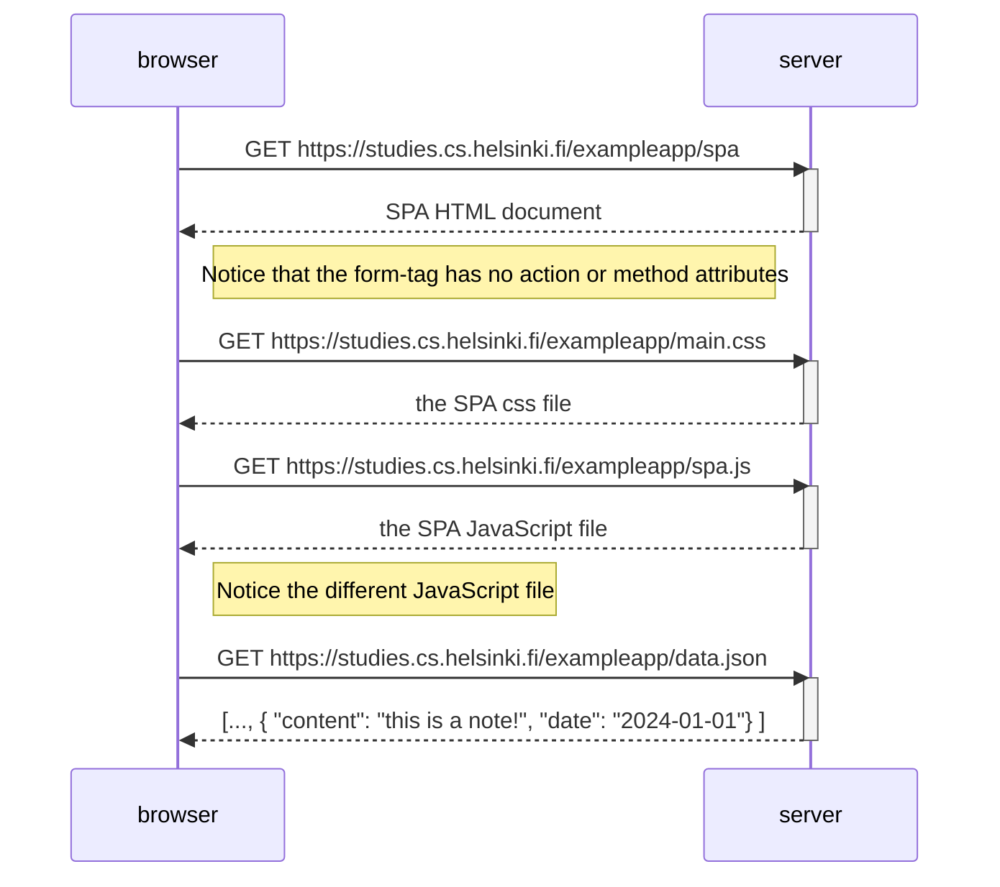

```mermaid
sequenceDiagram
  participant browser
  participant server

  browser->>server: GET https://studies.cs.helsinki.fi/exampleapp/spa
  activate server
  server-->>browser: SPA HTML document
  deactivate server

  Note right of browser: Notice that the form-tag has no action or method attributes

  browser->>server: GET https://studies.cs.helsinki.fi/exampleapp/main.css
  activate server
  server-->>browser: the SPA css file
  deactivate server

  browser->>server: GET https://studies.cs.helsinki.fi/exampleapp/spa.js
  activate server
  server-->>browser: the SPA JavaScript file
  deactivate server

  Note right of browser: Notice the different JavaScript file

  browser->>server: GET https://studies.cs.helsinki.fi/exampleapp/data.json
  activate server
  server-->>browser: [..., { "content": "this is a note!", "date": "2024-01-01"} ]
  deactivate server
```